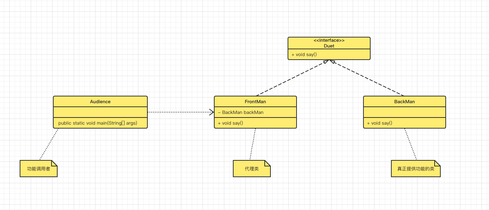

# 代理模式-Proxy Pattern

> 双簧节目大家都看过吧，一个在前面表演，一个在后面实际操作。我们看似是前面的人在讲话，实际上话语是后面人讲出的。这就是典型的代理模式应用场景。
>
> 看似出面人在做的事情:
>
> - 动作表演
> - ...
> - 讲话(实际讲话的动作是后面人发出的)
> - 气愤
> - ...

我们看下这个场景以Java程序是如何实现的，先来看下类图：



我们再来看下代码：

- 提供功能的接口

```java
package com.markus.designpattern.proxy;

/**
 * @author: markus
 * @date: 2022/7/9 11:44 上午
 * @Description: 双簧节目
 * @Blog: http://markuszhang.com/doc-blog
 * It's my honor to share what I've learned with you!
 */
public interface Duet {
    /*双簧节目就是讲话*/
    public void say();
}
```

- 功能实现类以及代理类

```java
package com.markus.designpattern.proxy;

/**
 * @author: markus
 * @date: 2022/7/9 11:49 上午
 * @Description: 双簧-实际说话的人
 * @Blog: http://markuszhang.com/doc-blog/
 * It's my honor to share what I've learned with you!
 */
public class BackMan implements Duet{
    @Override
    public void say() {
        System.out.println("出面人是大笨驴 哈哈哈(我才是实际说话的人)");
    }
}

package com.markus.designpattern.proxy;

/**
 * @author: markus
 * @date: 2022/7/9 11:48 上午
 * @Description: 代理-双簧的出面人
 * @Blog: http://markuszhang.com/doc-blog/
 * It's my honor to share what I've learned with you!
 */
public class FrontMan implements Duet {
    private BackMan backMan;

    public FrontMan() {
        this.backMan = new BackMan();//双簧演奏，出面人做为实际讲话人的代理
    }

    @Override
    public void say() {
        backMan.say();
    }
}
```

- 功能调用类

```java
package com.markus.designpattern.proxy;

/**
 * @author: markus
 * @date: 2022/7/9 11:52 上午
 * @Description: 观众-观看双簧节目
 * @Blog: http://markuszhang.com/doc-blog/
 * It's my honor to share what I've learned with you!
 */
public class Audience {
    public static void main(String[] args) {
        FrontMan duet = new FrontMan();//观众看到双簧节目的出面人
        duet.say();// 观众看着像是出面人在讲话，实际上是背后的人在讲话
    }
}
```

代理模式是对Java多态的应用，我们看到是代理类在干活，实际上干活的是被代理类。代理模式能解决我们这样一个场景：在某个方法执行前后希望能做些额外的事情。例如Spring AOP、事务等功能都使用了代理模式实现。