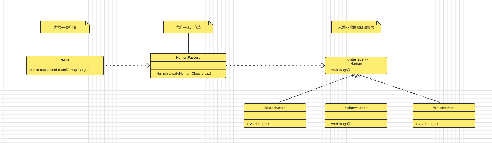

# 工厂方法模式-Factory Method Pattern

> 女娲来到世上，有些无聊，她拥有一个造人火炉，通过捏泥成人型，然后在炉里烧就能使得泥人变成人类
>
> - 起初掌握不够火候，炼的不够，成白人了
> - 加大火力，炼过头了，成黑人了
> - 经过不断的实践，掌握的火候刚刚好，炼成黄人了，nice！

工厂方法模式就能解决这样一个场景，将创建对象的职责与客户端分离开来，扩展性更好了，客户端不需要感知具体类的创建过程以及方式，这部分内容全部交给工厂方法来做。我们先来看下类图：



我们来看下代码实现：

- 产品接口及其子类

```java
package com.markus.designpattern.factorymethod;

/**
 * @author: markus
 * @date: 2022/7/10 5:59 下午
 * @Description: 人类接口
 * @Blog: http://markuszhang.com/doc-blog
 * It's my honor to share what I've learned with you!
 */
public interface Human {
    void laugh();
}

package com.markus.designpattern.factorymethod;/**
* @author: markus
* @date: 2022/7/10 6:00 下午
* @Description: 黄种人
* @Blog: http://markuszhang.com/doc-blog/
* It's my honor to share what I've learned with you!
*/
public class YellowHuman implements Human {
    @Override
    public void laugh() {
        System.out.println("黄种人大笑！");
    }
}

package com.markus.designpattern.factorymethod;/**
* @author: markus
* @date: 2022/7/10 6:01 下午
* @Description: 白种人
* @Blog: http://markuszhang.com/doc-blog/
* It's my honor to share what I've learned with you!
*/
public class WhiteHuman implements Human{
    @Override
    public void laugh() {
        System.out.println("白种人大笑！");
    }
}

package com.markus.designpattern.factorymethod;

/**
 * @author: markus
 * @date: 2022/7/10 5:59 下午
 * @Description: 黑人
 * @Blog: http://markuszhang.com/doc-blog/
 * It's my honor to share what I've learned with you!
 */
public class BlackHuman implements Human{
    @Override
    public void laugh() {
        System.out.println("黑人大笑！");
    }
}
```

- 对象创建工厂

```java
package com.markus.designpattern.factorymethod;

/**
 * @author: markus
 * @date: 2022/7/10 9:00 下午
 * @Description: 火炉
 * @Blog: http://markuszhang.com/doc-blog/
 * It's my honor to share what I've learned with you!
 */
public class HumanFactory {
    public static Human createHuman(Class clazz) {
        try {
            return (Human) Class.forName(clazz.getName()).newInstance();
        } catch (InstantiationException | IllegalAccessException | ClassNotFoundException e) {
            System.err.println("你要求的人类不合法，创造不出！");
        }
        return null;
    }
}
```

- 客户端

```java
package com.markus.designpattern.factorymethod;

/**
 * @author: markus
 * @date: 2022/7/10 9:04 下午
 * @Description: 女娲
 * @Blog: http://markuszhang.com/doc-blog/
 * It's my honor to share what I've learned with you!
 */
public class Nvwa {
    public static void main(String[] args) {
        Human yellowHuman = HumanFactory.createHuman(YellowHuman.class);
        yellowHuman.laugh();

        Human whiteHuman = HumanFactory.createHuman(WhiteHuman.class);
        whiteHuman.laugh();

        Human blackHuman = HumanFactory.createHuman(BlackHuman.class);
        blackHuman.laugh();
    }
}
```

前面说了工厂方法模式的好处：就是将创建对象和使用对象解耦，这样看起来扩展性和可维护性就会更好！

最后安利一个比较好的工具（在看资料的时候学到的）：可以由一个接口查找到所有的实现类！代码如下：

```java
package com.markus.designpattern.utils;

import java.io.File;
import java.io.IOException;
import java.net.URL;
import java.util.ArrayList;
import java.util.Enumeration;
import java.util.List;

/**
 * @author: markus
 * @date: 2022/7/10 9:36 下午
 * @Description: 类查找工具
 * @Blog: http://markuszhang.com/doc-blog/
 * It's my honor to share what I've learned with you!
 */
public class ClassUtils {
    public static List<Class> getAllClassByInterface(Class c) {
        List<Class> returnClassList = new ArrayList<>(); // 返回结果

        // 如果不是一个接口，则不做处理
        if (c.isInterface()) {
            String packageName = c.getPackage().getName(); // 获得当前的包名
            try {
                List<Class> allClass = getClasses(packageName); // 获取当前包下以及子包下的所有类
                for (int i = 0; i < allClass.size(); i++) {
                    if (c.isAssignableFrom(allClass.get(i))) { // 判断是不是一个接口
                        if (!c.equals(allClass.get(i))) { // 本身不加进去
                            returnClassList.add(allClass.get(i));
                        }
                    }
                }
            } catch (IOException | ClassNotFoundException e) {
                e.printStackTrace();
            }
        }
        return returnClassList;
    }

    private static List<Class> getClasses(String packageName) throws IOException, ClassNotFoundException {
        ClassLoader classLoader = Thread.currentThread().getContextClassLoader();
        String path = packageName.replace('.', '/');
        Enumeration<URL> resources = classLoader.getResources(path);
        List<File> dirs = new ArrayList<>();
        while (resources.hasMoreElements()) {
            URL resource = resources.nextElement();
            dirs.add(new File(resource.getFile()));
        }
        ArrayList<Class> classes = new ArrayList<>();
        for (File directory : dirs) {
            classes.addAll(findClasses(directory, packageName));
        }
        return classes;
    }

    private static List<Class> findClasses(File directory, String packageName) throws ClassNotFoundException {
        List<Class> classes = new ArrayList<>();
        if (!directory.exists()) {
            return classes;
        }
        File[] files = directory.listFiles();
        for (File file : files) {
            if (file.isDirectory()) {
                assert !file.getName().contains(".");
                classes.addAll(findClasses(file, packageName + "." + file.getName()));
            } else if (file.getName().endsWith(".class")) {
                classes.add(Class.forName(packageName + '.' + file.getName().substring(0, file.getName().length() - 6)));
            }
        }
        return classes;
    }
}
```

