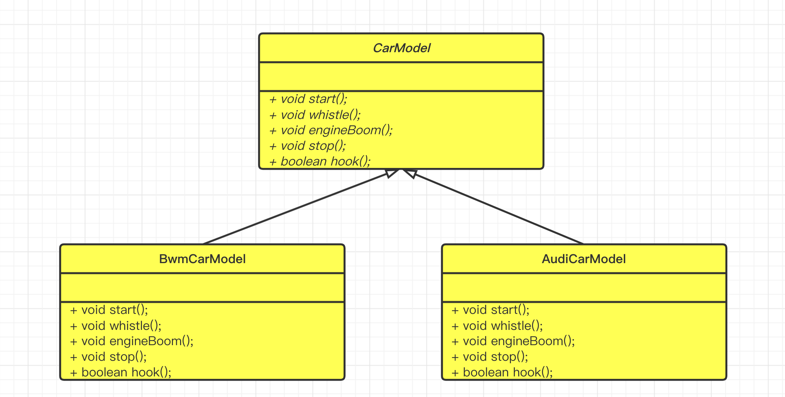

# 模板方法模式--TemplateMethod Pattern

> 模板方法比较简单，它定义一个操作中的算法流程框架，而将具体的一些步骤延迟到子类进行，使得子类可以不改变算法的结构即可重新定义该算法的某些特定步骤。子类只关注框架某些点的细节。
>
> 举个例子：一辆车从启动到停车流程，需要经过以下过程：
>
> - 启动
> - 引擎轰鸣声
> - 鸣笛
> - 停车

我们来看下它的UML图：



我们来看下Java程序：

- 模板方法类

```java
package com.markus.designpattern.templatemethod;

/**
 * @author: markus
 * @date: 2022/7/18 11:29 PM
 * @Description: 车模型-抽象类
 * @Blog: http://markuszhang.com/doc-blog/
 * It's my honor to share what I've learned with you!
 */
public abstract class CardModel {
  	// 模板方法
    public void run() {
        // 启动
        this.start();
        if (hook()) {
            // 默认不开启轰鸣声
            // 引擎轰鸣声
            this.engineBoom();
        }
        // 鸣笛
        this.whistle();
        // 停车
        this.stop();
    }

    protected boolean hook() {
        return false;
    }

    protected abstract void start();

    protected abstract void engineBoom();

    protected abstract void whistle();

    protected abstract void stop();
}
```

- 实现类

```java
package com.markus.designpattern.templatemethod;

/**
 * @author: markus
 * @date: 2022/7/18 11:32 PM
 * @Description: 宝马车
 * @Blog: http://markuszhang.com/doc-blog/
 * It's my honor to share what I've learned with you!
 */
public class BwmCardModel extends CardModel{

    @Override
    protected void start() {
        System.out.println("宝马车-启动");
    }

    @Override
    protected void engineBoom() {
        System.out.println("宝马车-轰鸣声");
    }

    @Override
    protected void whistle() {
        System.out.println("宝马车-鸣笛");
    }

    @Override
    protected void stop() {
        System.out.println("宝马车-停车");
    }

    @Override
    protected boolean hook() {
        // 宝马车想要体现出轰鸣声
        return true;
    }
}

package com.markus.designpattern.templatemethod;

/**
 * @author: markus
 * @date: 2022/7/18 11:32 PM
 * @Description: 奥迪
 * @Blog: http://markuszhang.com/doc-blog/
 * It's my honor to share what I've learned with you!
 */
public class AudiCardModel extends CardModel{

    @Override
    protected void start() {
        System.out.println("奥迪-启动");
    }

    @Override
    protected void engineBoom() {
        System.out.println("奥迪-轰鸣声");
    }

    @Override
    protected void whistle() {
        System.out.println("奥迪-鸣笛");
    }

    @Override
    protected void stop() {
        System.out.println("奥迪-停车");
    }
}
```

- 客户端

```java
package com.markus.designpattern.templatemethod;

/**
 * @author: markus
 * @date: 2022/7/18 11:35 PM
 * @Description: 客户端-用户看车
 * @Blog: http://markuszhang.com/doc-blog/
 * It's my honor to share what I've learned with you!
 */
public class Client {
    public static void main(String[] args) {
        CardModel bwm = new BwmCardModel();
        bwm.run();

        CardModel audi = new AudiCardModel();
        audi.run();
    }
}
```

模板方法模式优点：

- 封装不变部分、扩展可变部分
- 提取公共代码、便于维护
- 行为由父类控制、细节延迟到子类实现

模板方法模式缺点：

- 在复杂项目中，可能会带来阅读的难度，让新手产生不适（父类定义抽象方法，子类实现具体方法，子类影响父类的结果）

模板方法模式使用场景：

- 多个子类有公有的方法，并且逻辑基本相同时。
- 重要、复杂的算法，将其核心流程设计为模板方法，具体的细节交由子类实现，ReentrantLock底层的AbstractQueuedSynchonizer框架设计就是模板方法模式的实践，感兴趣的同学可以去了解下。