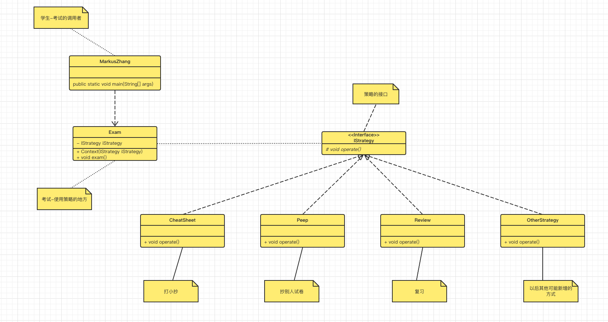

# 策略模式-Strategy Pattern

> 苦逼的MarkusZhang现在还在高中读书，总是要面对考试😭 为了应对考试，他想出了几种方法
>
> - 打小抄
> - 偷看旁边同学试卷
> - 好好复习
> - ...

此种场景我们通过Java程序如何实现呢？我们很容易想到的一种方式，if else语句来实现，我们的代码可能是下面这样：

```java
public class Strategy {
    public void operate(String[] args) {
        if (打小抄){
            打小抄的方式
        }else if (偷看){
            偷看的方式
        }else if (复习){
            好好复习
        }else if (...){
            其他方式
        }
    }
}
```

我们思考下，如果采用了上述方式会有什么影响？当应对考试的方式越来越多时，我们需要不断的修改这个策略类，会增加我们的修改和维护成本。那我们如何来实现呢？设计模式中的`策略模式`就帮助我们解决了这样的场景，我们先看下类图：



我们再来看下代码：

- 策略相关接口与实现类

```java
package com.markus.designpattern.strategy;

/**
 * @author: markus
 * @date: 2022/7/8 10:25 下午
 * @Description: 希望考试不挂科的策略接口
 * @Blog: http://markuszhang.com/doc-blog
 * It's my honor to share what I've learned with you!
 */
public interface IStrategy {
    public void operate();
}

```

```java
package com.markus.designpattern.strategy;

/**
 * @author: markus
 * @date: 2022/7/8 10:31 下午
 * @Description: 打小抄
 * @Blog: http://markuszhang.com/doc-blog/
 * It's my honor to share what I've learned with you!
 */
public class CheatSheet implements IStrategy {
    @Override
    public void operate() {
        System.out.println("打小抄");
    }
}

package com.markus.designpattern.strategy;

/**
 * @author: markus
 * @date: 2022/7/8 10:36 下午
 * @Description: 偷看同学试卷
 * @Blog: http://markuszhang.com/doc-blog/
 * It's my honor to share what I've learned with you!
 */
public class Peep implements IStrategy{
    @Override
    public void operate() {
        System.out.println("偷看同学试卷！");
    }
}

package com.markus.designpattern.strategy;

/**
 * @author: markus
 * @date: 2022/7/8 10:34 下午
 * @Description: 考前复习
 * @Blog: http://markuszhang.com/doc-blog/
 * It's my honor to share what I've learned with you!
 */
public class Review implements IStrategy{
    @Override
    public void operate() {
        System.out.println("考前好好复习，考试不挂科！");
    }
}
```

- 策略的应用场景

```java
package com.markus.designpattern.strategy;

/**
 * @author: markus
 * @date: 2022/7/8 10:38 下午
 * @Description: 考试
 * @Blog: http://markuszhang.com/doc-blog/
 * It's my honor to share what I've learned with you!
 */
public class Exam {
    private IStrategy iStrategy;

    public Exam(IStrategy iStrategy){
        this.iStrategy = iStrategy;
    }

    public void exam(){
        iStrategy.operate();
    }
}
```

- 策略的调用者

```java
package com.markus.designpattern.strategy;

/**
 * @author: markus
 * @date: 2022/7/8 10:27 下午
 * @Description: 苦逼考试人
 * @Blog: http://markuszhang.com/doc-blog/
 * It's my honor to share what I've learned with you!
 */
public class MarkusZhang {
    public static void main(String[] args) {
        IStrategy monthExamStrategy = new CheatSheet();//快要考试了，我准备打小抄
        Exam exam = new Exam(monthExamStrategy);//月考
        exam.exam();//考试了，别被逮着

        IStrategy midtermStrategy = new Peep();//快要期中考试了，我准备偷看同学试卷通过考试
        Exam midtermExam = new Exam(midtermStrategy);
        midtermExam.exam();

        IStrategy finalStrategy = new Review();//上次被逮着了，被记了大过，这次要好好复习了
        Exam finalExam = new Exam(finalStrategy);
        finalExam.exam();
    }
}
```

这样一个完整的策略模式就呈现出来了，完全体现了高内聚低耦合的特点。符合OCP，即开放封闭原则。新增策略只需要实现策略接口即可完成扩展，不修改原有相关的策略类，只需要在调用者处做出一些修改完善策略应用场景即可！