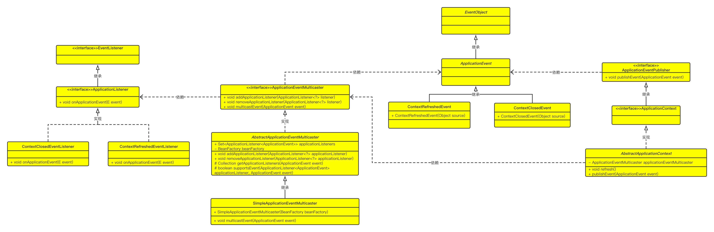

# 观察者模式-Observer Pattern

> 观察者模式，通常我们称之为发布订阅模式(Publish/Subscribe)，它是项目中经常使用的一种模式，其定义如下：定义对象间一种一对多的依赖关系，使得每当一个对象改变状态，则所有依赖于它的对象会得到通知并被自动更新。

最近在看Spring中的事件相关源码内容，它便是使用了观察者模式来进行事件发布等行为的。先来看下它的类图：



> 我们知道观察者模式中的各类可分为以下几种角色：
>
> - 事件
> - 发布者
> - 广播站
> - 监听者

我们就从上面几个角色来解释下Spring中有关容器事件的各个类都是什么作用：

一、事件

- ApplicationEvent：定义事件的抽象类，继承java.util.EventObject类，EventObject是所有事件状态对象的根类。
- ContextRefreshedEvent：容器刷新完成事件，是具体的事件对象。
- ContextClosedEvent：容器关闭事件，是具体的时间对象。

二、发布者

- ApplicationEventPublisher：事件发布者接口。
  - 定义发布事件方法
- ApplicationContext：Spring上下文的根接口。
- AbstractApplicationContext抽象类-负责发布的具体实现，它与ApplicationEventMulticaster合作，负责将事件添加到ApplicationEventMulticaster中。

三、广播器

- ApplicationEventMulticaster：事件广播器接口，定义事件的增、删、广播功能。
- AbstractApplicationEventMulticaster：事件广播器抽象类，实现广播器接口的通用功能，包括事件的增加、删除；还实现了获取监听者集合以及判断事件是否是相应监听者负责功能。
- SimpleApplicationEvent：广播器的具体类，实现了事件广播的功能。

四、监听者

- ApplicationListener：定义事件监听者职责，继承java.util.EventListener，EventListener是所有监听器接口需要继承的标记接口。
  - 定义了事件监听方法
- ContextRefreshedEventListener：具体的事件监听者，监听容器刷新事件，进行后续操作。

- ContextClosedEventListener：具体的事件监听者，监听容器关闭事件，进行后续操作。


下面我们看下代码

- 事件相关代码

```java
package com.markus.springframework.context;

import java.util.EventObject;

/**
 * @author: markus
 * @date: 2022/8/7 11:17 AM
 * @Description: 事件对象
 * @Blog: http://markuszhang.com/doc-blog/
 * It's my honor to share what I've learned with you!
 */
public abstract class ApplicationEvent extends EventObject {
    /**
     * Constructs a prototypical Event.
     *
     * @param source The object on which the Event initially occurred.
     * @throws IllegalArgumentException if source is null.
     */
    public ApplicationEvent(Object source) {
        super(source);
    }
}

package com.markus.springframework.context.event;
import com.markus.springframework.context.ApplicationContext;
import com.markus.springframework.context.ApplicationEvent;

/**
 * @author: markus
 * @date: 2022/8/7 11:19 AM
 * @Description: 上下文事件,定义事件的抽象类，所有的事件包括容器的刷新、关闭以及用户自定义事件，都需要继承此类
 * @Blog: http://markuszhang.com/doc-blog/
 * It's my honor to share what I've learned with you!
 */
public class ApplicationContextEvent extends ApplicationEvent {
    /**
     * Constructs a prototypical Event.
     *
     * @param source The object on which the Event initially occurred.
     * @throws IllegalArgumentException if source is null.
     */
    public ApplicationContextEvent(Object source) {
        super(source);
    }

    public final ApplicationContext getApplicationContext(){
        return (ApplicationContext) getSource();
    }
}

package com.markus.springframework.context.event;
/**
 * @author: markus
 * @date: 2022/8/7 11:20 AM
 * @Description: 容器关闭事件
 * @Blog: http://markuszhang.com/doc-blog/
 * It's my honor to share what I've learned with you!
 */
public class ContextClosedEvent extends ApplicationContextEvent{
    /**
     * Constructs a prototypical Event.
     *
     * @param source The object on which the Event initially occurred.
     * @throws IllegalArgumentException if source is null.
     */
    public ContextClosedEvent(Object source) {
        super(source);
    }
}

package com.markus.springframework.context.event;

/**
 * @author: markus
 * @date: 2022/8/7 11:21 AM
 * @Description: 容器启动事件
 * @Blog: http://markuszhang.com/doc-blog/
 * It's my honor to share what I've learned with you!
 */
public class ContextRefreshedEvent extends ApplicationContextEvent{
    /**
     * Constructs a prototypical Event.
     *
     * @param source The object on which the Event initially occurred.
     * @throws IllegalArgumentException if source is null.
     */
    public ContextRefreshedEvent(Object source) {
        super(source);
    }
}

```

- 发布者相关代码

```java
package com.markus.springframework.context;

/**
 * @author: markus
 * @date: 2022/8/7 12:10 PM
 * @Description: 应用事件发布者
 * @Blog: http://markuszhang.com/doc-blog
 * It's my honor to share what I've learned with you!
 */
public interface ApplicationEventPublisher {
    /**
     * 将应用程序事件通知向此应用程序注册的所有的监听器。
     * 事件可以是框架事件，如RequestHandleEvent；或者应用程序自定义事件
     * @param event
     */
    void publishEvent(ApplicationEvent event);
}

package com.markus.springframework.context.support;

import com.markus.springframework.beans.BeansException;
import com.markus.springframework.beans.factory.config.BeanFactoryPostProcessor;
import com.markus.springframework.beans.factory.config.BeanPostProcessor;
import com.markus.springframework.beans.factory.config.ConfigurableListableBeanFactory;
import com.markus.springframework.context.ApplicationEvent;
import com.markus.springframework.context.ApplicationListener;
import com.markus.springframework.context.ConfigurableApplicationContext;
import com.markus.springframework.context.event.ApplicationEventMulticaster;
import com.markus.springframework.context.event.ContextClosedEvent;
import com.markus.springframework.context.event.ContextRefreshedEvent;
import com.markus.springframework.context.event.SimpleApplicationEventMulticaster;
import com.markus.springframework.core.io.DefaultResourceLoader;

import java.util.Collection;
import java.util.Map;

/**
 * @author: markus
 * @date: 2022/7/17 5:51 PM
 * @Description: Spring应用上下文抽象类
 * @Blog: http://markuszhang.com/doc-blog/
 * It's my honor to share what I've learned with you!
 */
public abstract class AbstractApplicationContext extends DefaultResourceLoader implements ConfigurableApplicationContext {

    public static final String APPLICATION_EVENT_MULTICASTER_BEAN_NAME = "applicationEventMulticaster";

    private ApplicationEventMulticaster applicationEventMulticaster;

    @Override
    public void refresh() throws BeansException {
        // 6. 初始化事件发布者
        initApplicationEventMulticaster();

        // 7. 注册监听器
        registerListeners();

        // 8. 提前实例化单例Bean对象
        beanFactory.preInstantiateSingletons();

        // 9. 发布容器刷新完成事件
        finishRefresh();
    }

    private void initApplicationEventMulticaster() {
        ConfigurableListableBeanFactory beanFactory = getBeanFactory();
        applicationEventMulticaster = new SimpleApplicationEventMulticaster(beanFactory);
        beanFactory.registerSingleton(APPLICATION_EVENT_MULTICASTER_BEAN_NAME, applicationEventMulticaster);
    }

    private void registerListeners() {
        Collection<ApplicationListener> applicationListeners = getBeansOfType(ApplicationListener.class).values();
        for (ApplicationListener listener : applicationListeners) {
            applicationEventMulticaster.addApplicationListener(listener);
        }
    }

    private void finishRefresh() {
        publishEvent(new ContextRefreshedEvent(this));
    }

    @Override
    public void publishEvent(ApplicationEvent event) {
        applicationEventMulticaster.multicastEvent(event);
    }

    @Override
    public void registerShutdownHook() {
        Runtime.getRuntime().addShutdownHook(new Thread(this::close));
    }

    @Override
    public void close() {
        // 发布容器关闭事件
        publishEvent(new ContextClosedEvent(this));

        getBeanFactory().destroySingletons();
    }
  	// 其他代码不展示了
}
```

- 广播器相关代码

```java
package com.markus.springframework.context.event;

import com.markus.springframework.context.ApplicationEvent;
import com.markus.springframework.context.ApplicationListener;

/**
 * @author: markus
 * @date: 2022/8/7 11:23 AM
 * @Description: 容器事件广播器
 * @Blog: http://markuszhang.com/doc-blog
 * It's my honor to share what I've learned with you!
 */
public interface ApplicationEventMulticaster {
    /**
     * 添加应用事件
     * @param applicationListener
     */
    void addApplicationListener(ApplicationListener<?> applicationListener);


    /**
     * 从事件集合里删除某个事件
     * @param listener
     */
    void removeApplicationListener(ApplicationListener<?> listener);

    /**
     * 将事件广播到合适的监听者
     * @param event
     */
    void multicastEvent(ApplicationEvent event);
}

package com.markus.springframework.context.event;

import com.markus.springframework.beans.BeansException;
import com.markus.springframework.beans.factory.BeanFactory;
import com.markus.springframework.beans.factory.BeanFactoryAware;
import com.markus.springframework.context.ApplicationEvent;
import com.markus.springframework.context.ApplicationListener;
import com.markus.springframework.util.ClassUtils;

import java.lang.reflect.ParameterizedType;
import java.lang.reflect.Type;
import java.util.Collection;
import java.util.LinkedHashSet;
import java.util.LinkedList;
import java.util.Set;

/**
 * @author: markus
 * @date: 2022/8/7 11:41 AM
 * @Description: 应用事件广播器抽象类
 * @Blog: http://markuszhang.com/doc-blog/
 * It's my honor to share what I've learned with you!
 */
public abstract class AbstractApplicationEventMulticaster implements ApplicationEventMulticaster, BeanFactoryAware {
    public final Set<ApplicationListener<ApplicationEvent>> applicationListeners = new LinkedHashSet<>();

    private BeanFactory beanFactory;

    @Override
    public void addApplicationListener(ApplicationListener<?> applicationListener) {
        applicationListeners.add((ApplicationListener<ApplicationEvent>) applicationListener);
    }

    @Override
    public void removeApplicationListener(ApplicationListener<?> listener) {
        applicationListeners.remove(listener);
    }

    @Override
    public void setBeanFactory(BeanFactory beanFactory) throws BeansException {
        this.beanFactory = beanFactory;
    }

    protected Collection<ApplicationListener> getApplicationListeners(ApplicationEvent event) {
        LinkedList<ApplicationListener> allListeners = new LinkedList<>();
        for (ApplicationListener<ApplicationEvent> listener : applicationListeners) {
            if (supportsEvent(listener, event)) allListeners.add(listener);
        }
        return allListeners;
    }

    protected boolean supportsEvent(ApplicationListener<ApplicationEvent> applicationListener, ApplicationEvent event) {
        Class<? extends ApplicationListener> listenerClass = applicationListener.getClass();

        Class<?> targetClass = ClassUtils.isCglibProxyClass(listenerClass) ? listenerClass.getSuperclass() : listenerClass;
        Type genericInterface = targetClass.getGenericInterfaces()[0];
        Type actualTypeArgument = ((ParameterizedType) genericInterface).getActualTypeArguments()[0];

        String className = actualTypeArgument.getTypeName();
        Class<?> eventClassName;
        try {
            eventClassName = Class.forName(className);
        } catch (ClassNotFoundException e) {
            throw new BeansException("wrong event class name: " + className);
        }

        return eventClassName.isAssignableFrom(event.getClass());
    }
}


package com.markus.springframework.context.event;

import com.markus.springframework.beans.BeansException;
import com.markus.springframework.beans.factory.BeanFactory;
import com.markus.springframework.context.ApplicationEvent;
import com.markus.springframework.context.ApplicationListener;

/**
 * @author: markus
 * @date: 2022/8/7 2:49 PM
 * @Description: 应用事件广播器实现类
 * @Blog: http://markuszhang.com/doc-blog/
 * It's my honor to share what I've learned with you!
 */
public class SimpleApplicationEventMulticaster extends AbstractApplicationEventMulticaster {

    public SimpleApplicationEventMulticaster(BeanFactory beanFactory) {
        setBeanFactory(beanFactory);
    }

    @Override
    public void multicastEvent(ApplicationEvent event) {
        for (final ApplicationListener listener : getApplicationListeners(event)) {
            listener.onApplicationEvent(event);
        }

    }
}

```

- 监听器相关代码

```java
package com.markus.springframework.context;
import java.util.EventListener;
/**
 * @author: markus
 * @date: 2022/8/7 11:25 AM
 * @Description: 应用监听器
 * @Blog: http://markuszhang.com/doc-blog
 * It's my honor to share what I've learned with you!
 */
public interface ApplicationListener<E extends ApplicationEvent> extends EventListener {

    /**
     * 处理 事件
     * @param event
     */
    void onApplicationEvent(E event);
}

package com.markus.springframework.test.event;
import com.markus.springframework.context.ApplicationListener;
import com.markus.springframework.context.event.ContextClosedEvent;
/**
 * @author: markus
 * @date: 2022/8/7 3:13 PM
 * @Description: 容器关闭事件监听器
 * @Blog: http://markuszhang.com/doc-blog/
 * It's my honor to share what I've learned with you!
 */
public class ContextClosedEventListener implements ApplicationListener<ContextClosedEvent> {
    @Override
    public void onApplicationEvent(ContextClosedEvent event) {
        System.out.println("关闭事件: " + this.getClass().getName());
    }
}

package com.markus.springframework.test.event;
import com.markus.springframework.context.ApplicationListener;
import com.markus.springframework.context.event.ContextRefreshedEvent;

/**
 * @author: markus
 * @date: 2022/8/7 3:12 PM
 * @Description: 容器刷新监听器
 * @Blog: http://markuszhang.com/doc-blog/
 * It's my honor to share what I've learned with you!
 */
public class ContextRefreshedEventListener implements ApplicationListener<ContextRefreshedEvent> {
    @Override
    public void onApplicationEvent(ContextRefreshedEvent event) {
        System.out.println("刷新事件: " + this.getClass().getName());
    }
}
```

- 测试相关代码

```xml
<?xml version="1.0" encoding="UTF-8"?>
<beans>
    <bean class="com.markus.springframework.test.event.ContextClosedEventListener"/>
    <bean class="com.markus.springframework.test.event.ContextRefreshedEventListener"/>

</beans>
```

```java
package com.markus.springframework.test;

import com.markus.springframework.context.support.ClassPathXmlApplicationContext;
import com.markus.springframework.test.event.CustomEvent;
import org.junit.Test;

/**
 * @author: markus
 * @date: 2022/8/7 3:17 PM
 * @Description: 事件单元测试类
 * @Blog: http://markuszhang.com/doc-blog/
 * It's my honor to share what I've learned with you!
 */
public class EventTest {
    @Test
    public void test_event() {
        ClassPathXmlApplicationContext context = new ClassPathXmlApplicationContext("classpath:META-INF/applicationContextForEvent.xml");
        context.registerShutdownHook();
    }
}
```


上面这是我在手写Spring的时候涉及事件相关的代码，如果有感兴趣的同学可以去到我的仓库克隆下来找到相应的单元测试类运行即可，可自己debug看下其中的流程 [地址](https://github.com/markuszcl99/rough-spring)

最终我们来看下观察者模式的通用类图：


观察者模式的优缺点以及使用场景：

- 优点：
  - 观察者与被观察者之间是抽象耦合，无论对观察者还是被观察者都是非常的易扩展。
  - 建立一套事件触发机制。
- 缺点：
  - 开发效率和运行效率，一个主题，多个观察者，调试起来效率不是很高，并且循环广播的时候是串行执行的，如果一个观察者执行效率很低的话，整体会受影响，不过也可以设计成异步的。
- 使用场景：
  - 关联行为场景。需要注意的是，关联行为是可拆分的，而不是“组合”关系。
  - 事件多级触发场景。
  - 跨系统的消息交换场景，如消息队列的处理机制。