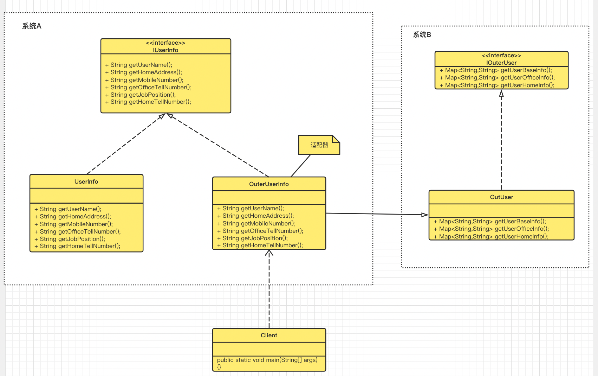

# 适配器模式--Adapter Pattern

> 适配器模式是一种将一个既有类的接口转换成想要的接口，以便适应系统的原有架构调用，举个例子，我们国家的插座一般是两口+三口的，而欧洲的插座就只有三插头的，当我们带着手机或者电脑（充电器为二插头的）去到欧洲时，我们在给设备充电时就会使用一个中间设备用于连接充电器和插座。这个中间设备就是一个适配器。这样的一个过程对应到系统设计模式上就是适配器模式。
>
> 对应到编程上，可能会遇到两个系统在描述一种功能，只不过有业务区分，例如公司员工信息与外包员工信息，起初维护了两套系统并且数据结构并不一致，而公司期望两者统一到公司员工信息系统上，那么就可以通过适配器模式来设计这块的功能

我们看下适配器的UML图：



我们看下具体实现：

- 系统A用户定义及其实现

```java
package com.markus.designpattern.adapter;

/**
 * @author: markus
 * @date: 2022/7/17 2:03 PM
 * @Description: 用户信息接口
 * @Blog: http://markuszhang.com/doc-blog
 * It's my honor to share what I've learned with you!
 */
public interface IUserInfo {
    String getUserName();

    String getHomeAddress();

    String getMobileNumber();

    String getOfficeTellNumber();

    String getJobPosition();

    String getHomeTellNumber();
}

package com.markus.designpattern.adapter;

/**
 * @author: markus
 * @date: 2022/7/17 2:05 PM
 * @Description: 用户信息实现类
 * @Blog: http://markuszhang.com/doc-blog/
 * It's my honor to share what I've learned with you!
 */
public class UserInfo implements IUserInfo{

    @Override
    public String getUserName() {
        System.out.println("这里是员工的姓名....");
        return null;
    }

    @Override
    public String getHomeAddress() {
        System.out.println("这里是员工的家庭住址...");
        return null;
    }

    @Override
    public String getMobileNumber() {
        System.out.println("这里是员工的手机号...");
        return null;
    }

    @Override
    public String getOfficeTellNumber() {
        System.out.println("这里是员工的办公室电话号...");
        return null;
    }

    @Override
    public String getJobPosition() {
        System.out.println("这里是员工的职位描述...");
        return null;
    }

    @Override
    public String getHomeTellNumber() {
        System.out.println("这里是员工的家庭号码...");
        return null;
    }
}
```

- 系统B用户信息定义及其实现

```java
package com.markus.designpattern.adapter;

import java.util.Map;

/**
 * @author: markus
 * @date: 2022/7/17 2:07 PM
 * @Description: 外包用户接口
 * @Blog: http://markuszhang.com/doc-blog/
 * It's my honor to share what I've learned with you!
 */
public interface IOuterUser {
    Map<String,String> getUserBaseInfo();
    Map<String,String> getUserOfficeInfo();
    Map<String,String> getUserHomeInfo();
}

package com.markus.designpattern.adapter;

import java.util.HashMap;
import java.util.Map;

/**
 * @author: markus
 * @date: 2022/7/17 2:11 PM
 * @Description: 外包用户信息实现类-被适配者
 * @Blog: http://markuszhang.com/doc-blog/
 * It's my honor to share what I've learned with you!
 */
public class OuterUser implements IOuterUser {
    @Override
    public Map<String, String> getUserBaseInfo() {
        HashMap<String, String> baseInfoMap = new HashMap<>();

        baseInfoMap.put("userName", "这个员工叫做孙悟空");
        baseInfoMap.put("mobileNumber", "这个员工电话是...");
        return baseInfoMap;
    }

    @Override
    public Map<String, String> getUserOfficeInfo() {
        HashMap<String, String> userOfficeInfo = new HashMap<>();

        userOfficeInfo.put("jobPosition", "这个员工职位是...");
        userOfficeInfo.put("officeTellNumber", "这个员工的办公室电话是...");
        return userOfficeInfo;
    }

    @Override
    public Map<String, String> getUserHomeInfo() {
        HashMap<String, String> userHomeInfo = new HashMap<>();

        userHomeInfo.put("homeTellNumber", "这个员工家庭电话是...");
        userHomeInfo.put("homeAddress", "这个员工家庭地址是...");
        return userHomeInfo;
    }
}
```

- 适配器

```java
package com.markus.designpattern.adapter;

/**
 * @author: markus
 * @date: 2022/7/17 2:21 PM
 * @Description: 将外包用户信息接入当前系统-（类）适配器
 * @Blog: http://markuszhang.com/doc-blog/
 * It's my honor to share what I've learned with you!
 */
public class OuterUserInfo extends OuterUser implements IUserInfo{
    @Override
    public String getUserName() {
        System.out.println(super.getUserBaseInfo().get("userName"));
        return null;
    }

    @Override
    public String getHomeAddress() {
        System.out.println(super.getUserHomeInfo().get("homeAddress"));
        return null;
    }

    @Override
    public String getMobileNumber() {
        System.out.println(super.getUserBaseInfo().get("mobileNumber"));
        return null;
    }

    @Override
    public String getOfficeTellNumber() {
        System.out.println(super.getUserOfficeInfo().get("officeTellNumber"));
        return null;
    }

    @Override
    public String getJobPosition() {
        System.out.println(super.getUserOfficeInfo().get("jobPosition"));
        return null;
    }

    @Override
    public String getHomeTellNumber() {
        System.out.println(super.getUserHomeInfo().get("homeTellNumber"));
        return null;
    }
}
```

- 客户端-调用者

```java
package com.markus.designpattern.adapter;

/**
 * @author: markus
 * @date: 2022/7/17 2:27 PM
 * @Description: 客户端--调用用户信息者
 * @Blog: http://markuszhang.com/doc-blog/
 * It's my honor to share what I've learned with you!
 */
public class Client {
    public static void main(String[] args) {
        IUserInfo userInfo = new UserInfo();
        System.out.println("--------------正式员工信息--------------");
        userInfo.getHomeAddress();
        userInfo.getUserName();
        userInfo.getHomeTellNumber();
        userInfo.getJobPosition();
        userInfo.getMobileNumber();
        userInfo.getOfficeTellNumber();
        System.out.println("--------------------------------------");
        IUserInfo outUserInfo = new OuterUserInfo();
        System.out.println("--------------外包员工信息--------------");
        outUserInfo.getHomeAddress();
        outUserInfo.getUserName();
        outUserInfo.getHomeTellNumber();
        outUserInfo.getJobPosition();
        outUserInfo.getMobileNumber();
        outUserInfo.getOfficeTellNumber();
        System.out.println("--------------------------------------");
    }
}
```

