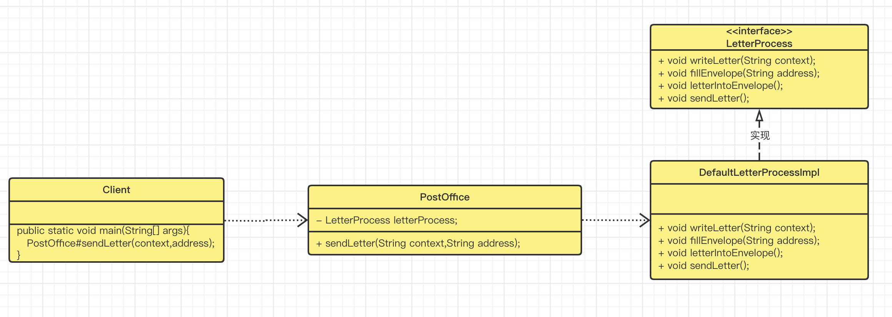

# 门面模式--Facade Pattern

> 门面方法模式意图是将一个功能内部复杂的请求调用封装起来，提供一个统一的接口给外界调用，这样能使得调用者不用关心功能实现的内部逻辑，只需要关心调用接口实现某项功能即可。
>
> 比如说写信的过程包括：
>
> - 写信的正文
> - 写信封的地址
> - 将信放到信封中
> - 邮递信封

我们如果将上述步骤挨个封装成一个个接口，那么调用者需要知道每个接口的功能以及调用的先后顺序，这样会给使用者带来比较大的使用成本，而门面模式就是解决这种问题的，它提供出一个门面类，这个类封装复杂功能算法逻辑，提供出一个方法供使用者调用，调用者只需要了解这个接口的功能，并且在适当场合调用它即可，内部是怎么实现的，调用者无需关心！我们先来看下门面模式的UML图：



我们来看下代码实现：

- 子系统接口及实现类

```java
package com.markus.designpattern.facade;
/**
 * @author: markus
 * @date: 2022/7/17 11:01 上午
 * @Description: 写信处理
 * @Blog: http://markuszhang.com/doc-blog
 * It's my honor to share what I've learned with you!
 */
public interface LetterProcess {
    /**
     * 写信的内容
     *
     * @param context
     */
    void writeContext(String context);

    /**
     * 写信封
     *
     * @param address
     */
    void fillEnvelop(String address);

    /**
     * 将信放在信封里
     */
    void letterIntoEnvelope();

    /**
     * 将信邮递
     */
    void sendLetter();
}

package com.markus.designpattern.facade;
/**
 * @author: markus
 * @date: 2022/7/17 1:35 下午
 * @Description: 默认的写信流程内容
 * @Blog: http://markuszhang.com/doc-blog/
 * It's my honor to share what I've learned with you!
 */
public class DefaultLetterProcess implements LetterProcess {
    @Override
    public void writeContext(String context) {
        System.out.println("写信内容为：" + context);
    }

    @Override
    public void fillEnvelop(String address) {
        System.out.println("信封地址为：" + address);
    }

    @Override
    public void letterIntoEnvelope() {
        System.out.println("将信纸放进信封中");
    }

    @Override
    public void sendLetter() {
        System.out.println("投递信封");
    }
}
```

- 门面类：

```java
package com.markus.designpattern.facade;

/**
 * @author: markus
 * @date: 2022/7/17 1:31 下午
 * @Description: 邮局-提供模板方法的类
 * @Blog: http://markuszhang.com/doc-blog/
 * It's my honor to share what I've learned with you!
 */
public class PostOffice {
    private LetterProcess letterProcess = new DefaultLetterProcess();

    public PostOffice() {

    }

    public PostOffice(LetterProcess letterProcess) {
        this.letterProcess = letterProcess;
    }

    public void sendLetter(String context, String address) {
        letterProcess.writeContext(context);
        letterProcess.fillEnvelop(address);
        letterProcess.letterIntoEnvelope();
        letterProcess.sendLetter();
    }
}
```

- 调用者-客户端

```java
package com.markus.designpattern.facade;

/**
 * @author: markus
 * @date: 2022/7/17 1:40 下午
 * @Description: 写信者
 * @Blog: http://markuszhang.com/doc-blog/
 * It's my honor to share what I've learned with you!
 */
public class Client {
    public static void main(String[] args) {
        PostOffice postOffice = new PostOffice();
        postOffice.sendLetter("实践是最好的领悟方式","未来局");
    }
}
```

