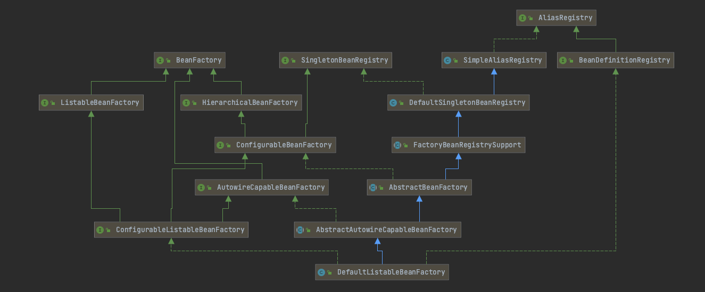

# Spring-IoC容器

## 一、什么是Spring-IoC容器

> Spring IoC容器来负责对象的生命周期和对象之间的关系

对于IoC容器我们拆开来说：IoC与容器。什么是IoC？什么是容器？

### IoC

IoC全称为`Inversion of Control`，翻译为“控制反转”，它是一种思想，它在Spring中是通过依赖注入（即Dependency Injection，简称DI）实现的。

理解什么是控制反转，关键在于理解以下几点：

- 谁控制谁
- 控制什么
- 为何是反转
- 哪些方面反转了

我们来看个例子：

```java
package com.markus.demo.IoC;

/**
 * @author: markus
 * @date: 2022/7/8 12:07 上午
 * @Description: 年轻小伙子
 * @Blog: http://markuszhang.com/
 * It's my honor to share what I've learned with you!
 */
public class YoungMan {
    private BeautifulGirl beautifulGirl;

    public YoungMan() {
        // 牛逼，指腹为婚
        // this.beautifulGirl = new BeautifulGirl();
    }

    public YoungMan(BeautifulGirl beautifulGirl) {
        this.beautifulGirl = beautifulGirl;
    }

    public BeautifulGirl getBeautifulGirl() {
        return beautifulGirl;
    }

    public void setBeautifulGirl(BeautifulGirl beautifulGirl) {
        this.beautifulGirl = beautifulGirl;
    }

    public static void main(String[] args) {
        BeautifulGirl beautifulGirl = new BeautifulGirl();// 理解好控制反转，重点在于看这个对象的实例化是由谁来生成的
        YoungMan youngMan = new YoungMan(beautifulGirl);// 构造器注入
        youngMan.setBeautifulGirl(beautifulGirl);// setter方法注入
    }
}

```

针对这个例子，我们来回答下上面提到的四个点：

- 谁控制谁：Spring容器控制对象内容，而不是由对象控制自身内容
- 控制什么：Spring容器控制对象的生命周期
- 为何是反转：反转的意义在于对象对自身内容的控制权交给了Spring容器，从主动生产到被动接受
- 哪些方面反转了：所依赖对象的获取被反转了

理解完上面几个点，我们就对IoC有个比较清晰的了解了，没有IoC之前我们是需要什么就自己去拿，有了IoC之后，只需要告诉IoC我们需要什么东西，东西的成产让IoC负责并当我们需要时给送过来。

### 容器

理解完IoC之后，那什么又是容器呢？我觉得凡是可以存储数据的具体数据结构实现，都可以称之为容器。例如ArrayList、LinkedList、HashSet、HashMap等，Spring存储BeanDefinition的容器采用的是ConcurrentHashMap。下面是它的定义

```java
// bean 定义对象的映射，以 bean 名称为键
private final Map<String, BeanDefinition> beanDefinitionMap = new ConcurrentHashMap<>(256);
```

我们可以将ConcurrentHashMap理解为一个线程安全的HashMap，这里简单介绍下HashMap：HashMap是一种基于扰动函数、负载因子、红黑树转换等技术内容，形成的拉链寻址的数据结构，它能让数据更加散列的分布在哈希桶以及碰撞时形成的链表和红黑树。它的数据结构会尽可能最大限度的让整个数据读取的时间复杂度在O(1) ~ O(logn) ~ O(n)之间，当然在极端情况下也会有O(n)链表查找数据较多的情况。

参考资料表示：`10万数据的扰动函数进行寻址验证测试，数据会均匀的散列在各个哈希桶索引上`，所以HashMap非常适合用在Spring Bean的容器实现上。

## 二、BeanFactory

> 我们知道Spring最底层最核心的东西就是Bean工厂--BeanFactory了。这块简单介绍下Spring中的BeanFactory及其子类。

### 类图

先看下BeanFactory顶级接口及其子接口和实现类的类图：



### 类介绍

| 类或接口                           | 作用                                                         |
| :--------------------------------- | :----------------------------------------------------------- |
| BeanFactory                        | 用于访问Spring Bean接口的根接口                              |
| ListableBeanFactory                | BeanFactory接口的扩展，可以根据Bean类型查找相关Bean的所有实例 |
| HierarchicalBeanFactory            | BeanFactory接口的扩展，提供容器继承功能                      |
| ConfigurableBeanFactory            |                                                              |
| AutowireCapableBeanFactory         |                                                              |
| ConfigurableListableBeanFactory    |                                                              |
| SingletonBeanRegistry              |                                                              |
| DefaultSingletonBeanRegistry       |                                                              |
| FactoryBeanRegistrySupport         |                                                              |
| AbstractBeanFactory                |                                                              |
| AbstractAutowiredCapableBeanFctory |                                                              |
| DefaultListableBeanFactory         |                                                              |
| AliasRegistry                      |                                                              |
| SimpleAliasRegistry                |                                                              |
| BeanDefinitionRegistry             |                                                              |

