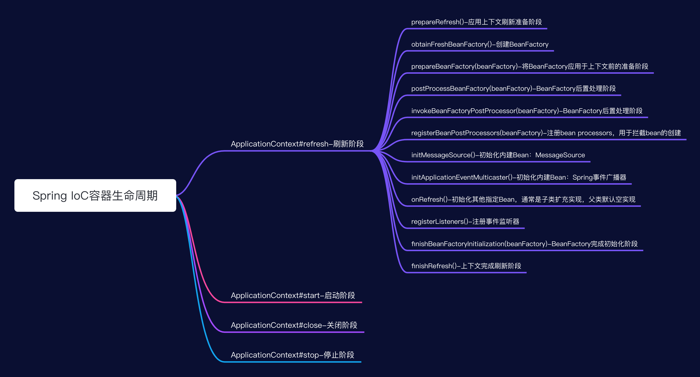

# Spring笔记目录
> 笔记来源：《小马哥讲Spring核心编程思想》
> 链接：https://time.geekbang.org/course/intro/100042601?tab=catalog

## 一、Spring IoC容器概述

- [Spring-IoC容器概述](./docs/framework/spring/IoC/spring-IoC容器.md)

## 二、Spring Bean基础
## 三、Spring IoC依赖查找
## 四、Spring IoC依赖注入
## 五、Spring IoC依赖来源
## 六、Spring Bean作用域
## 七、Spring Bean生命周期
## 八、Spring 配置元信息
## 九、Spring 资源管理
## 十、Spring 国际化
## 十一、Spring 校验
## 十二、Spring 数据绑定
## 十三、Spring 类型转换
## 十四、Spring 泛型处理
## 十五、Spring 事件
## 十六、Spring 注解
## 十七、Spring Environment抽象
## 十八、Spring 应用上下文生命周期
> Spring应用上下文生命周期，即ApplicationContext上下文的刷新、启动、停止、关闭等的流程，下面是各个阶段的大致流程图，刷新阶段比较重要

- [Spring应用上下文生命周期](./docs/framework/spring/IoC/Spring应用上下文生命周期.md)

## 十九、Spring相关面试题汇总

