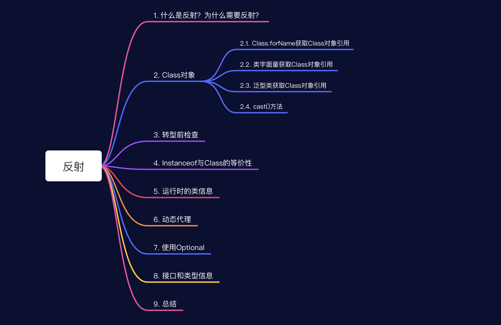
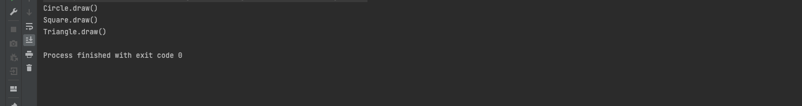
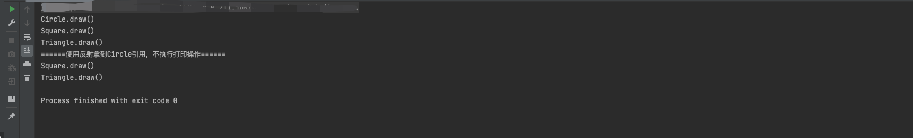

# Java基础-反射

> 为什么要记录这篇文章？
>
> 最近在研究Spring源码，可以看到框架内部大量使用反射，比如对象的实例化依靠JDK动态代理或者Cglib代理生成。而动态代理的底层实现也是依靠反射来完成的。下面我们会有记录。
>
> 本文大部分内容来源于《On Java》--反射章节。

## 本文概览



## 一、什么是反射？为什么需要反射？

>  好的，来到正文。对于学习反射，我们首先需要要明确它的概念以及为什么要学它？

那什么是反射呢？反射其实就是可以在程序运行时发现并使用对象的类型信息，通俗点讲就是它能帮助我们在程序中动态的创建对象并且使用对象里的任何字段和方法。

为什么要学习它呢？它使我们在编程中摆脱了只能在编译时执行面向类型操作的限制，进而编写出更强大的程序，当然可能在我们的日常业务开发中很少使用到反射，但研究优秀框架源码的过程中可以发现，这些框架都会大量的使用反射，在运行时操作对象。（ps：我只看过spring的一点源码哈哈）

**对于为什么需要它，这里举个常见的例子：**

- 定义一个抽象类Shape，作用是描述一个物体的形状
- 它有三个实现类，分别是：Circle、Square、Triangle

首先，我们编程的原则就是面向接口编程，我们可能会有下面这样一段程序：

```java
package com.markus.on.java.blog.reflect;

/**
 * @author: markus
 * @date: 2022/8/21 9:51 PM
 * @Description: 用来描述形状的接口
 * @Blog: http://markuszhang.com/doc-blog
 * It's my honor to share what I've learned with you!
 */
public abstract class Shape {
    public String draw() {
        return this + ".draw()";
    }

    @Override
    public abstract String toString();
}

public class Triangle extends Shape {
    @Override
    public String toString() {
        return "Triangle";
    }
}

public class Circle extends Shape {
    @Override
    public String toString() {
        return "Circle";
    }
}

public class Square extends Shape {
    @Override
    public String toString() {
        return "Square";
    }
}

package com.markus.on.java.blog.reflect;
import java.util.ArrayList;
import java.util.List;
/**
 * @author: markus
 * @date: 2022/8/21 9:55 PM
 * @Description: 使用形状的客户端
 * @Blog: http://markuszhang.com/doc-blog/
 * It's my honor to share what I've learned with you!
 */
public class ShapeClient {
    public static void main(String[] args) {
        // 一般我们编程都遵循面向接口或抽象编程的原则，所以可能会有以下这样一段程序

        // 1. 我们从数据源中获取Shape对象集合
        List<Shape> shapes = getShapes();//多态，我们只需要知道是Shape集合
        shapes.forEach(Shape::draw);// 执行Shape的draw操作，至于怎么执行取决于Shape所指向的引用
    }

    private static List<Shape> getShapes() {
        List<Shape> shapes = new ArrayList<>();
        shapes.add(new Circle());
        shapes.add(new Square());
        shapes.add(new Triangle());
        return shapes;
    }
}

```



但此时，我们想要某个形状的对象实例不在控制台打印出来，但看客户端程序我们在编译时无法判断出当前Shape是指向哪个实现类的引用，这个时候我们就可以通过反射拿到Shape引用所指向的确切类型，从而避免在控制台中打印，程序是这样的：

```java
public class ShapeClient {
    public static void main(String[] args) {
        // 一般我们编程都遵循面向接口或抽象编程的原则，所以可能会有以下这样一段程序

        // 1. 我们从数据源中获取Shape对象集合
        List<Shape> shapes = getShapes();//多态，我们只需要知道是Shape集合
        shapes.forEach(Shape::draw);// 执行Shape的draw操作，至于怎么执行取决于Shape所指向的引用

        System.out.println("======使用反射拿到Circle引用，不执行打印操作======");
        shapes.stream()
                .filter(shape -> shape.getClass() != Circle.class)
                .forEach(Shape::draw);
    }

    private static List<Shape> getShapes() {
        List<Shape> shapes = new ArrayList<>();
        shapes.add(new Circle());
        shapes.add(new Square());
        shapes.add(new Triangle());
        return shapes;
    }
}
```



## 二、Class对象

> 在上面示例中，我们使用到了Class对象，下面就来介绍下Class对象，它是实现Java反射工作的必要信息。

Class这一特殊对象用来表示运行时的类型信息，它包含了与类相关的信息。Java中的每个类都有一个Class对象，每次编译一个新类时所生成的对象(被相应的存储在同名的.class文件中)，然后经过JVM的加载、链接、初始化操作后生成一个实例对象用于应用程序中。

Java语言中从编写的源码文件到运行时的对象使用会经过以下几个阶段：

编译时：从java文件到.class文件

运行时：加载->链接(验证、准备、解析)->初始化->使用->销毁


对于Class对象，我们需要掌握以下几点：

- Class对象只被加载一遍，类加载器会检查内存中是否加载了某类型的Class对象，如果没有，类加载器才会定位到相应的.class文件，加载该字节码文件，并且会被**验证**确保文件没有被损坏以及不包含恶意的Java代码
- 静态代码块的初始化是在类加载时执行的
- 


反射基本理论

class对象介绍

类字面量

泛型类的引用

cast

转型前的检查

注册工厂

instanceof与Class的等价性

运行时类信息

动态代理

使用Optional

接口和类型信息


